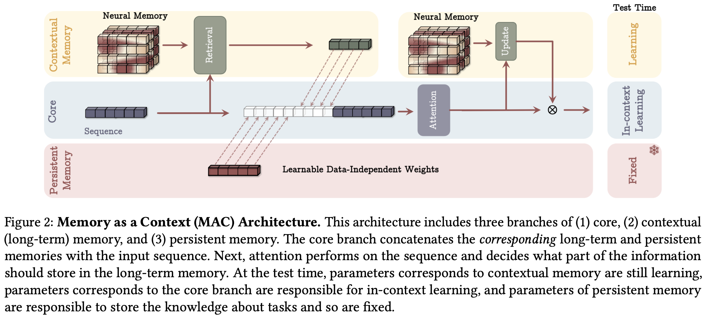
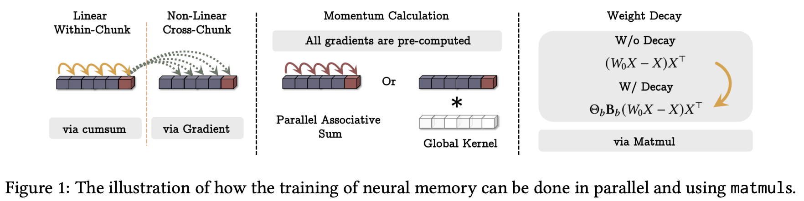

# Atlas-Torch

An open-source implementation of [ATLAS: Learning to Optimally Memorize the Context at Test Time](https://arxiv.org/abs/2505.23735) (Behrouz et al., 2025), built on top of [lucidrains' titans-pytorch](https://github.com/lucidrains/titans-pytorch) (commit `714a14c`, preserved on the `titans-torch` branch).

It is a working, paper-faithful port. The three Atlas additions (the Omega Rule, polynomial feature mapping, and Muon-style spectral normalization) are implemented and checked against the paper, with runtime tests in `tests/test_titans.py` that assert the paper-mandated transformations actually fire. Several correctness bugs in the underlying memory code are also fixed. The table below lists exactly what was added and what was fixed.

## How the memory works

The neural memory is a small MLP whose weights *are* the memory. It learns at inference, by gradient descent, as it reads the sequence.

At each token it takes one step of test-time learning. It projects the token to a key and a value, asks the memory MLP to predict the value from the key, and takes the gradient of that reconstruction error with respect to the memory's own weights. That gradient is the "surprise". For a linear memory it reduces to (prediction error) ⊗ (key), the classic delta-rule associative write, and the MLP is the nonlinear version of the same idea. A token the memory already predicts well produces a near-zero gradient and barely moves it; a surprising token moves it a lot. There is no store-or-not threshold. The update is continuous and proportional, shaped by learned gates for step size (the adaptive learning rate), carry-over (momentum), and forgetting (a decay gate that makes the memory leaky on purpose).

So there are two loops. The inner loop above is the memory learning at test time. The outer loop is ordinary training: you run the full forward pass, including those inner updates, compute the language-modeling loss, and backpropagate through it, which means differentiating through the inner gradient. A gradient of a gradient. That second-order pass teaches the gates how to learn, what to store, how fast, and what to forget, and it is also the dominant memory cost, because the inner-gradient graph has to be kept so the outer pass can flow through it. That graph is incompatible with gradient checkpointing, which is what caps how many memory layers fit on a single GPU.

At inference there is no outer pass. The gates are frozen, so the inner gradient is computed, applied, and discarded. That makes inference cheap in compute at any context length (memory is another matter — see the limitations below), and it is why "the model adapts to the document or the user as it reads" is realistic rather than aspirational.

What this does not do for free is retain. The decay gate means the memory adapts to recent context more than it permanently accumulates, so durable retention across very long contexts, the thing that would turn this into a continually-improving model rather than a continually-adapting one, is the open problem rather than a solved feature. It is the question this repository was built to probe, and the one the small-scale experiments here did not reach.

## Changes from lucidrains' Titans

### Atlas Extensions (arXiv:2505.23735)

| Component | File | Description |
|-----------|------|-------------|
| Polynomial Features | `neural_memory.py` | `PolynomialFeatures` class — exact monomial expansion via `combinations_with_replacement`, learnable coefficients (1/d!), optional `project_back` (Section 3.1) |
| Omega Rule | `neural_memory.py` | Per-token gradients via nested `vmap(vmap(grad))`, gamma-weighted sliding window with learned context gates, per-position momentum/decay scan (Sections 3.2-3.3) |
| Muon / Newton-Schulz | `neural_memory.py` | `newtonschulz5()` — 5-iteration spectral normalization on surprise updates (Section 5, Eq 32) |
| Short Convolution | `neural_memory.py` | `CausalDepthwiseConv1d` — causal depthwise conv (kernel=4) on keys/values/queries (paper Section 5 architectural backbone) |
| Sequential Scan | `neural_memory.py` | O(1) forward memory alternative to parallel AssocScan for momentum/decay |
| Detach Segment Memory | `neural_memory.py` | Truncated outer-loop backprop across segments — standard TTT approximation for memory efficiency |
| `atlas_config()` | `neural_memory.py` | Convenience classmethod returning recommended Atlas defaults |

#### Known deviations from the paper's MAC

The transformer around the memory is lucidrains' MAC, not a line-by-line port of the paper's. The paper's MAC retrieves with the pre-update state M_{t−1} and writes the attention output into memory; this MAC reads the post-update per-token state and writes the residual-stream input view. Memory retrieval enters the residual stream rather than being prepended to the attention window as context tokens. These are inherited design choices, applied identically to both the Titans and Atlas variants, so within-repo comparisons are unaffected.

### Bug Fixes

| Fix | File | Description |
|-----|------|-------------|
| bf16 dtype mismatch | `mac_transformer.py` | Cast persistent memory to match query dtype for flex_attention compatibility under autocast |
| O(n²) autograd memory | `neural_memory.py` | Replace incremental `cat` in `accum_updates` with single-cat — reduces autograd memory from O(segments²) to O(segments) |
| Conv empty sequence | `neural_memory.py` | Guard `CausalDepthwiseConv1d` against 0-length input during autoregressive inference |
| Omega incompatibility guards | `neural_memory.py` | Assertions preventing omega with `num_kv_per_token > 1` or `store_with_lookahead_value` |
| Omega window slide | `neural_memory.py` | Fixed shifted-gradient slice direction (2026-09-01): pre-fix, the window collapsed to a per-position gate multiplier with no cross-token mixing; now guarded by value-level tests against a brute-force reference of the paper equation |
| Store-path gradient starvation | `experiments/configs.py` | `detach_segment_memory` off in the training config (2026-09-01): with the interleaved sequence exceeding `neural_memory_batch_size`, detach froze the learned memory init and cut store-side params off from most outer-loop gradient |
| Absolute positional embedding out of distribution beyond the training length | `mac_transformer.py`, `experiments/configs.py` | New `use_axial_pos_emb` flag, off in the experiment config (2026-09-02): the continuous axial embedding feeds raw integer segment indices into an MLP, so at eval lengths beyond training its norm grows ~linearly with position — measured at random init, three seeds: 7.6× the trained range at 4K for a 1K-trained model, ~1950× at 1M (a trained checkpoint has not been measured yet; `eval/diagnostics/axial_pos_emb_extrapolation.py --checkpoint` does that); rotary already carries within-window position and the memory is position-free |

Checkpoints trained before these fixes are incompatible with current code: strict loading fails (the new value conv adds parameters), and they are semantically stale under the fixed omega window — loading them with `strict=False` silently runs a randomly-initialized value conv in the store path. Do not evaluate old checkpoints on new code.

### Configuration

```python
import torch
from titans_pytorch import NeuralMemory

config = NeuralMemory.atlas_config()          # Omega Rule + polynomial features + Muon-normalized surprise
mem = NeuralMemory(dim=768, dim_head=48, heads=16, chunk_size=8, **config).cuda()

seq = torch.randn(2, 1024, 768).cuda()
retrieved, _ = mem(seq)
assert retrieved.shape == seq.shape           # (2, 1024, 768)
```

The snippet requires a CUDA GPU. For a full MAC-transformer training example, see the `USE_ATLAS` toggle in `train_mac.py`.

## Install

This fork is not published to PyPI. Install it from source:

```bash
git clone https://github.com/danielquintas8/atlas-torch
cd atlas-torch
pip install -e .
```

The `pip install titans-pytorch` line in the inherited section below installs Phil Wang's upstream package, not this fork.

## Status and scope

This repository is an implementation, not a research result. I used it for small-scale experiments at 170M parameters, and those runs did not reach a scale where the model has measurable long-context capability, so they produced no conclusions about Atlas's long-context behavior. The value here is the code and the documented fixes and limitations, not a finding.

Four known limitations are worth reading before building on this at scale: the polynomial memory capacity bound under the default configuration (tracked in the [issues](https://github.com/danielquintas8/atlas-torch/issues)); an autograd memory constraint (the per-token gradient path is incompatible with gradient checkpointing) that caps how many memory layers fit on a single GPU; and a parallel-vs-decoding mismatch — token-by-token decoding (`model.sample()`) runs a different memory than the parallel forward. With per-token retrieve (the Atlas configuration, `omega_context > 1`) decoding reads the state after the last store-cache flush instead of each token's own post-update state, so it deviates from the first token at any batch size (3.7 max logit deviation at `omega_context=8` with the batch equal to the store chunk, toy geometry, fp64); on top of that, omega windows truncate at flush boundaries during decoding but span the full neural-memory batch segment in parallel mode. On the `omega_context=1` path the remaining difference is the key/value short convs, which zero-pad at every flush while the parallel forward pads once per memory segment whenever `neural_memory_batch_size` exceeds `chunk_size` (2.6 max logit deviation at batch size 64 in the same toy geometry, 1.27 in an earlier one; exactly 8.9e-16 when the batch size equals the store chunk). The query short conv is not part of the mismatch: the carried `retrieve_conv_cache` gives decoding the same previous query rows the parallel forward sees. Training, likelihood-style evaluation (e.g. BABILong scoring) and chunked inference use the parallel forward's segmenting and are unaffected. The fourth is an evaluation memory ceiling: with per-token retrieve (the Atlas config), the whole-sequence forward materializes every token's memory-weight state for the final retrieve — at 170M that is 0.59 MB per token per memory layer in bf16 (1.18 MB per token for the two shipped layers; double in fp32): 4.8 GB at 4K, 19 GB at 16K, 39 GB at 32K, 78 GB at 64K and 1.2 TB at 1M for the retrieve state alone — and the store path holds several per-token-sized copies on top of it at once (a live-tensor high-water tracker measured the forward peaking at 2.8–10× the retrieve state across toy geometries and lengths, highest within one memory segment and where the attention path is a large share of the total; with the attention path subtracted the memory-only ratio is 3.7–5.6× within one segment and 1–1.6× at 4–8 segments). `eval/babilong/evaluate.py` estimates the peak before each length as a flat 8× the retrieve state of the positions processed at once plus a separate attention/residual term, re-checks that estimate against live measurements in `tests/test_babilong_scorer.py` (never under, at most 5× over), and refuses to run past 80% of the device's memory unless `--force` is given. On a 64 GB H100 at 170M with two memory layers that estimate allows roughly 5K tokens in bf16 (about 2.5K in fp32); the measured ratios would allow two to three times more, but chunked inference makes the whole-sequence cap moot. **Chunked inference removes the ceiling**: `MemoryAsContextTransformer.iter_chunked_hidden` / `forward_chunked` (and `--chunk-len` in the evaluator and the NLL diagnostic) process the sequence in chunks of `chunk_len` *interleaved* positions — a multiple of `neural_memory_batch_size`, so chunk boundaries coincide with the memory's own segment boundaries — carrying only the memory state and each attention layer's un-rotated keys/values for the last two attention segments across chunks. Each chunk is folded into attention segments exactly as the whole-sequence forward folds the full sequence, so attention memory is linear in the chunk. The output equals the whole-sequence forward (fp64-exact parity tests for the Atlas, Titans, memory-free, axial-embedding and block-attention configurations) and peak memory is O(chunk): about 10 GB by the estimate (about 6 GB at the measured ratios) at 170M in bf16 with 1024-position chunks, at any context length. One API change supports it: `NeuralMemory.retrieve_memories` now returns `(retrieved, next_conv_cache)` instead of the tensor alone, and `NeuralMemState` carries a sixth field, `retrieve_conv_cache` (default `None`), holding the previous call's last pre-conv query rows.

---

> **Note**: The `titans-torch` branch contains the original [Titans - PyTorch](https://gitlab.com/lucidrains/titans-pytorch) implementation by [Phil Wang (lucidrains)](https://gitlab.com/lucidrains), taken as-is from his GitLab repository (commit `714a14c`). All credit for this implementation goes to him.

</img>

</img>

## Titans - Pytorch

Unofficial implementation of [Titans](https://arxiv.org/abs/2501.00663) in Pytorch. Will also contain some explorations into architectures beyond their simple 1-4 layer MLP for the neural memory module, if it works well to any degree.

[Paper review by Yannic](https://www.youtube.com/watch?v=v67plFw1nMw)

[Quick Colab Run](https://colab.research.google.com/drive/11cGgSABykte3qbK-hjzPgLif3-9UUejm?usp=sharing)

## Appreciation

- [Eryk](https://github.com/sentialx) for sharing his early experimental results with me, positive for 2 layer MLP

## Install

```bash
$ pip install titans-pytorch
```

## Usage

```python
import torch
from titans_pytorch import NeuralMemory

mem = NeuralMemory(
    dim = 384,
    chunk_size = 64 # set to smaller chunk size for better perf on smaller sequence lengths (but more memory usage)
).cuda()

seq = torch.randn(2, 1024, 384).cuda()
retrieved, mem_state = mem(seq)

assert seq.shape == retrieved.shape
```

A transformer with the `MAC` configuration can be used as

```python
import torch
from titans_pytorch import MemoryAsContextTransformer

transformer = MemoryAsContextTransformer(
    num_tokens = 256,
    dim = 256,
    depth = 2,
    segment_len = 128,              # local attention window size
    num_persist_mem_tokens = 4,
    num_longterm_mem_tokens = 16,
)

token_ids = torch.randint(0, 256, (1, 1023))

loss = transformer(token_ids, return_loss = True) # (1, 1023, 256)
loss.backward()

# after much training

sampled = transformer.sample(token_ids[:, :4], 512)
```

## Experiments

```bash
$ pip install uv
```

Then modify `train_mac.py` and run it to query nature

```bash
$ uv run train_mac.py
```

## Citations

```bibtex
@inproceedings{Behrouz2024TitansLT,
    title   = {Titans: Learning to Memorize at Test Time},
    author  = {Ali Behrouz and Peilin Zhong and Vahab S. Mirrokni},
    year    = {2024},
    url     = {https://api.semanticscholar.org/CorpusID:275212078}
}
```

```bibtex
@article{Sun2024LearningT,
    title   = {Learning to (Learn at Test Time): RNNs with Expressive Hidden States},
    author  = {Yu Sun and Xinhao Li and Karan Dalal and Jiarui Xu and Arjun Vikram and Genghan Zhang and Yann Dubois and Xinlei Chen and Xiaolong Wang and Oluwasanmi Koyejo and Tatsunori Hashimoto and Carlos Guestrin},
    journal = {ArXiv},
    year    = {2024},
    volume  = {abs/2407.04620},
    url     = {https://api.semanticscholar.org/CorpusID:271039606}
}
```

```bibtex
@inproceedings{Yang2024GatedDN,
    title   = {Gated Delta Networks: Improving Mamba2 with Delta Rule},
    author  = {Songlin Yang and Jan Kautz and Ali Hatamizadeh},
    year    = {2024},
    url     = {https://api.semanticscholar.org/CorpusID:274598177}
}
```

```bibtex
@inproceedings{Nguyen2024TurningUT,
    title   = {Turning Up the Heat: Min-p Sampling for Creative and Coherent LLM Outputs},
    author  = {Minh Nguyen and Andrew Baker and Clement Neo and Allen Roush and Andreas Kirsch and Ravid Shwartz-Ziv},
    year    = {2024},
    url     = {https://api.semanticscholar.org/CorpusID:270870613}
}
```

```bibtex
@article{Zhu2024HyperConnections,
    title   = {Hyper-Connections},
    author  = {Defa Zhu and Hongzhi Huang and Zihao Huang and Yutao Zeng and Yunyao Mao and Banggu Wu and Qiyang Min and Xun Zhou},
    journal = {ArXiv},
    year    = {2024},
    volume  = {abs/2409.19606},
    url     = {https://api.semanticscholar.org/CorpusID:272987528}
}
```

```bibtex
@article{Zhou2024ValueRL,
    title   = {Value Residual Learning For Alleviating Attention Concentration In Transformers},
    author  = {Zhanchao Zhou and Tianyi Wu and Zhiyun Jiang and Zhenzhong Lan},
    journal = {ArXiv},
    year    = {2024},
    volume  = {abs/2410.17897},
    url     = {https://api.semanticscholar.org/CorpusID:273532030}
}
```

```bibtex
@software{Kyrylov_Accelerated_Scan_2024,
    author  = {Kyrylov, Volodymyr},
    doi     = {10.5281/zenodo.10600962},
    title   = {Accelerated Scan},
    version = {0.1.2},
    year    = {2024}
}
```

```bibtex
@misc{wang2025testtimeregressionunifyingframework,
    title   = {Test-time regression: a unifying framework for designing sequence models with associative memory},
    author  = {Ke Alexander Wang and Jiaxin Shi and Emily B. Fox},
    year    = {2025},
    eprint  = {2501.12352},
    archivePrefix = {arXiv},
    primaryClass = {cs.LG},
    url     = {https://arxiv.org/abs/2501.12352},
}
```

```bibtex
@misc{jordan2024muon,
    author  = {Keller Jordan and Yuchen Jin and Vlado Boza and Jiacheng You and
                    Franz Cesista and Laker Newhouse and Jeremy Bernstein},
    title   = {Muon: An optimizer for hidden layers in neural networks},
    year    = {2024},
    url     = {https://kellerjordan.github.io/posts/muon/}
}
```

```bibtex
@inproceedings{Zhang2025TestTimeTD,
    title   = {Test-Time Training Done Right},
    author  = {Tianyuan Zhang and Sai Bi and Yicong Hong and Kai Zhang and Fujun Luan and Songlin Yang and Kalyan Sunkavalli and William T. Freeman and Hao Tan},
    year    = {2025},
    url     = {https://api.semanticscholar.org/CorpusID:279071244}
}
```

```bibtex
@inproceedings{Behrouz2025ATLASLT,
    title  = {ATLAS: Learning to Optimally Memorize the Context at Test Time},
    author = {Ali Behrouz and Ze-Minghui Li and Praneeth Kacham and Majid Daliri and Yuan Deng and Peilin Zhong and Meisam Razaviyayn and Vahab S. Mirrokni},
    year   = {2025},
    url    = {https://api.semanticscholar.org/CorpusID:278996373}
}
```

```bibtex
@misc{zhao2026fastweightproductkeymemory,
    title   = {Fast-weight Product Key Memory}, 
    author  = {Tianyu Zhao and Llion Jones},
    year    = {2026},
    eprint  = {2601.00671},
    archivePrefix = {arXiv},
    primaryClass = {cs.CL},
    url     = {https://arxiv.org/abs/2601.00671}, 
}
```
